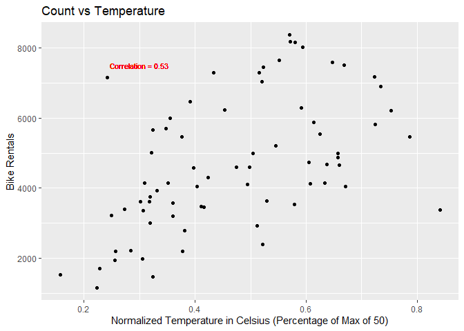

Project 2
================
Kolton Wiebusch & Yuying Zhou
10/21/2020

  - [Required Packages](#required-packages)
  - [Introduction](#introduction)
      - [Purpose:](#purpose)
      - [Methods:](#methods)
      - [Data:](#data)
      - [Variables:](#variables)
  - [Data Split](#data-split)
  - [Summarizations](#summarizations)
  - [Plots](#plots)
  - [Modeling](#modeling)
      - [Regression Tree Model](#regression-tree-model)
      - [Boosted Tree Model](#boosted-tree-model)
      - [Linear Regression Model](#linear-regression-model)
  - [Test Set Predictions](#test-set-predictions)

# Required Packages

``` r
library(tidyverse)
library(caret)
library(knitr)
library(rpart)
library(rattle)
library(forcats)
library(rmarkdown)
```

# Introduction

## Purpose:

Use bike sharing data to analyze and create models predicting the cnt
response variable.

## Methods:

Load data in and select important variables only. Filter results for
each day of the week and create training and test sets from that data.
Produce some summary statistics and plots about the training data to
explore it. Fit a regression tree based model and a boosted tree model
on the data, then apply the fits on the test sets.

``` r
#Read in the data
bike <- read_csv("../day.csv")

#Getting an idea for what predictors have the best
summary(lm(cnt ~ . - casual - registered, data = bike))
```

    ## 
    ## Call:
    ## lm(formula = cnt ~ . - casual - registered, data = bike)
    ## 
    ## Residuals:
    ##     Min      1Q  Median      3Q     Max 
    ## -4035.5  -446.9    46.5   548.2  2956.1 
    ## 
    ## Coefficients: (1 not defined because of singularities)
    ##              Estimate Std. Error t value Pr(>|t|)    
    ## (Intercept)  1326.457    248.267   5.343 1.23e-07 ***
    ## instant        -8.048      3.674  -2.190 0.028811 *  
    ## dteday             NA         NA      NA       NA    
    ## season        508.276     54.617   9.306  < 2e-16 ***
    ## yr           4986.655   1346.467   3.704 0.000229 ***
    ## mnth          206.655    113.424   1.822 0.068877 .  
    ## holiday      -522.868    200.519  -2.608 0.009308 ** 
    ## weekday        69.187     16.256   4.256 2.36e-05 ***
    ## workingday    122.130     71.822   1.700 0.089480 .  
    ## weathersit   -623.752     78.374  -7.959 6.79e-15 ***
    ## temp         2178.956   1401.652   1.555 0.120491    
    ## atemp        3391.410   1587.380   2.136 0.032978 *  
    ## hum          -960.439    314.303  -3.056 0.002328 ** 
    ## windspeed   -2520.931    455.384  -5.536 4.35e-08 ***
    ## ---
    ## Signif. codes:  0 '***' 0.001 '**' 0.01 '*' 0.05 '.' 0.1 ' ' 1
    ## 
    ## Residual standard error: 870.1 on 718 degrees of freedom
    ## Multiple R-squared:  0.8016, Adjusted R-squared:  0.7983 
    ## F-statistic: 241.7 on 12 and 718 DF,  p-value: < 2.2e-16

``` r
#Recreating the bike dataset with variables of interest
bike %>% select(season, holiday, weekday, workingday, weathersit, atemp, hum, windspeed, cnt) -> bike

#Resetting weekday to be factors
bike$weekday <- as.factor(bike$weekday)

#Resetting weekday column to show days of the week
bike <- bike %>% mutate(weekday = fct_recode(weekday, 
                                             "Monday" = "1",
                                             "Tuesday" = "2",
                                             "Wednesday" = "3",
                                             "Thursday" = "4",
                                             "Friday" = "5",
                                             "Saturday" = "6",
                                             "Sunday" = "0"))
```

## Data:

This data contains the daily count of rental bikes between 2011 and 2012
in Capital bike share system with the corresponding weather and seasonal
information.

## Variables:

After looking to see what variables had high p-values in a linear model
when predicting the response of cnt, as well as removing casual and
registered due to the instructions, I narrowed it down to 9. Cnt
represents the count of rental bikes daily. Season can be broken down
into 1 = winter, 2 = spring, 3 = summer, 4 = fall. Holiday returns 1 if
the day is a holiday. Weekday has a numeric value representing each day
of the week, from 0 = Sunday to 6 = Saturday. Workingday returns 1 if
the day is neither a weekend nor holiday. Weathersit has 4 levels
increasing in intensity: 1 - clear or few clouds, 2 - Mist or cloudy, 3
-light snow or light rain with some thunderstorms and scattered clouds,
4 - Heavy Rain/Sleet/Snow/Thunderstorms (More severe). Atemp is a
derived value of normalized feeling temperature out of max 50. Hum is
normalized humidity values divided to 100 (max). Windspeed is normalized
wind speed values divided to 67 (max).

# Data Split

``` r
#Filtering the data by weekday
bike %>% filter(weekday == params$day) -> newbike

#Splitting the data 70/30
set.seed(23)

train <- sample(1:nrow(newbike), size = nrow(newbike)*0.7)
test <- dplyr::setdiff(1:nrow(newbike), train)

bikeTrain <- newbike[train, ]
bikeTest <- newbike[test, ]
```

# Summarizations

These summary statistics give several looks at the response variable
cnt, or the count of rented bikes on this specific weekday for the
training data. The first one shows basic summary statistics for the
count. The second breaks the average and standard deviation of daily
count down by each season (1 = winter, 2 = spring, 3 = summer, 4 =
fall). The third breaks the average of daily count down by weather
situation on this weekday (1 = clear, 2 = cloudy, 3 = light
precipitation, 4 = heavy or severe precipitation).

``` r
#Summary stats of the response variable cnt
summary(bikeTrain$cnt)
```

    ##    Min. 1st Qu.  Median    Mean 3rd Qu.    Max. 
    ##    1167    3440    4582    4710    6046    8362

``` r
#Summary stats of mean and standard deviation of count of rented bikes by season on this weekday
bikeTrain %>% group_by(season) %>% summarise(avg = mean(cnt), sd = sd(cnt)) -> sm1
kable(sm1)
```

| season |      avg |       sd |
| -----: | -------: | -------: |
|      1 | 2895.125 | 1026.439 |
|      2 | 5174.438 | 2042.858 |
|      3 | 5787.700 | 1495.944 |
|      4 | 4713.000 | 1593.057 |

``` r
#Summary stats of mean of count of rented bikes by weather situation on this weekday
bikeTrain %>% group_by(weathersit) %>% summarise(avg = mean(cnt)) -> sm2
kable(sm2)
```

| weathersit |      avg |
| ---------: | -------: |
|          1 | 5090.476 |
|          2 | 4177.567 |

# Plots

These scatter plots give a visual of how the response variable cnt, or
count of the rented bikes on this specific weekday for the training
data, correlates with several other continuous predictors. Overall, we
can see that temperature has the strongest correlation with the count;
as temperature increases, the number of bikes rented increases. The
correlations with humidity and wind speed are not quite as strong, but
it does appear that as wind speed increases, generally, the number of
bikes rented decreases somewhat.

``` r
#count vs wind speed scatter plot
wind <- ggplot(bikeTrain, aes(x = windspeed, y = cnt))
wind + geom_point() + labs(title = "Count vs Wind Speed", x = "Wind Speed (Percentage of Max of 67 MPH)", y = "Bike Rentals") + geom_text(x = .3, y = 7500, size = 3, label = paste0("Correlation = ", round(cor(bikeTrain$windspeed, bikeTrain$cnt), 2)), col = "red")
```

<!-- -->

``` r
#count vs temp scatter plot
temp <- ggplot(bikeTrain, aes(x = atemp, y = cnt))
temp + geom_point() + labs(title = "Count vs Temperature", x = "Normalized Temperature in Celsius (Percentage of Max of 50)", y = "Bike Rentals") + geom_text(x = .3, y = 7500, size = 3, label = paste0("Correlation = ", round(cor(bikeTrain$atemp, bikeTrain$cnt), 2)), col = "red")
```

<!-- -->

``` r
#count vs humidity scatter plot
humidity <- ggplot(bikeTrain, aes(x = hum, y = cnt))
humidity + geom_point() + labs(title = "Count vs Humidity", x = "Normalized Humidity Values (Percentage of Max of 100)", y = "Bike Rentals") + geom_text(x = .4, y = 7500, size = 3, label = paste0("Correlation = ", round(cor(bikeTrain$hum, bikeTrain$cnt), 2)), col = "red")
```

<!-- -->

# Modeling

## Regression Tree Model

The first model to be fit on this training data is a regression tree
model. This fit uses recursive binary splitting and tries to minimize
residual sums of squares at each predictor. The response variable the
model is trying to predict for is cnt, or the count of bike rentals. The
predictors are all 8 other variables narrowed down in the introduction
section. Leave one out cross validation is used, which is a type of
cross-validation approach in which each observation is considered as the
validation set and the rest (N-1 observations) are considered as the
training set. This method helps reduce bias and randomness. The tuning
parameter of cp for the rpart method is set to replicate at 10 values to
see which fit has the lowest RMSE and MAE and the highest R-squared
value. After the everything has run, the optimal model will be chosen
and saved in the object to later be used on the test set. Details about
the final model are shown below.

``` r
#Using caret package to fit training data to regression tree using LOOCV
bikeReg <- train(cnt ~ ., data = bikeTrain, method = "rpart",
                 trControl = trainControl(method = "LOOCV"),
                 tuneLength = 10)

#Display fit details
bikeReg
```

    ## CART 
    ## 
    ## 72 samples
    ##  8 predictor
    ## 
    ## No pre-processing
    ## Resampling: Leave-One-Out Cross-Validation 
    ## Summary of sample sizes: 71, 71, 71, 71, 71, 71, ... 
    ## Resampling results across tuning parameters:
    ## 
    ##   cp          RMSE      Rsquared    MAE     
    ##   0.00000000  1622.987  0.27820177  1288.748
    ##   0.03341426  1633.848  0.27089230  1295.337
    ##   0.06682853  1803.377  0.13594231  1485.157
    ##   0.10024279  1724.570  0.15788244  1407.438
    ##   0.13365705  1738.426  0.14887947  1415.884
    ##   0.16707131  1738.426  0.14887947  1415.884
    ##   0.20048558  1738.426  0.14887947  1415.884
    ##   0.23389984  1738.426  0.14887947  1415.884
    ##   0.26731410  1738.426  0.14887947  1415.884
    ##   0.30072836  2131.926  0.06401603  1913.413
    ## 
    ## RMSE was used to select the optimal model using the smallest value.
    ## The final value used for the model was cp = 0.

``` r
#Best tuning parameter value for the final model
kable(bikeReg$bestTune)
```

| cp |
| -: |
|  0 |

``` r
#Displaying the final model
fancyRpartPlot(bikeReg$finalModel, main = "Regression Tree Model for cnt Variable on Training Data", sub = NULL)
```

<!-- -->

## Boosted Tree Model

The second model to be fit on this training data is a boosted tree
model. This fit is basically a slow training of trees, as predictions
are updated as the tree grows. The response variable the model is trying
to predict for is cnt, or the count of bike rentals. The predictors are
all 8 other variables narrowed down in the introduction section.
Repeated cross validation is used, with the parameters of number = 10
and repeats = 5. Thus, 10 different folds of cross validation is
repeated 5 times. Also tuning parameters set for the gbm model are
interaction.depth, n.trees, shrinkage, and n.minobsinnode. These all
have various lengths to check except for shrinkage. After this has all
been run, a final model with the lowest RMSE and MAE and highest R
Squared will be selected for use on the test set. Details about the
final model are shown below.

``` r
#Using caret package to fit training data to boosted tree model using repeated cv
bikeBoost <- train(cnt ~ ., data = bikeTrain, method = "gbm",
                   trControl = trainControl(method = "repeatedcv", number = 10, repeats = 5),
                   verbose = FALSE, tuneGrid = expand.grid(interaction.depth = c(1,2,3,4,5), 
                                                           n.trees = c(25, 50, 75, 100, 125, 150),
                                                           shrinkage = 0.1, n.minobsinnode = c(5, 10, 15)))

#Best tuning parameter values for the final model
kable(bikeBoost$bestTune)
```

|   | n.trees | interaction.depth | shrinkage | n.minobsinnode |
| :- | ------: | ----------------: | --------: | -------------: |
| 3 |      75 |                 1 |       0.1 |              5 |

``` r
#Details about final model
bikeBoost$finalModel
```

    ## A gradient boosted model with gaussian loss function.
    ## 75 iterations were performed.
    ## There were 13 predictors of which 5 had non-zero influence.

## Linear Regression Model

``` r
m3<-lm(cnt~ season+weathersit+hum+windspeed, data=bikeTrain)
```

# Test Set Predictions

``` r
#Setting up test set predictions
testBikeRT <- predict(bikeReg, newdata = bikeTest)
testBikeBoost <- predict(bikeBoost, newdata = bikeTest)
lm_pred<-predict(m3, newdata = bikeTest)

#Comparing fit results from the two models on the test sets
postResample(testBikeRT, bikeTest$cnt)
```

    ##         RMSE     Rsquared          MAE 
    ## 1545.1866535    0.3542973 1310.3750000

``` r
postResample(testBikeBoost, bikeTest$cnt)
```

    ##         RMSE     Rsquared          MAE 
    ## 1406.0373402    0.4694051 1235.7752309

``` r
postResample(lm_pred,bikeTest$cnt)
```

    ##         RMSE     Rsquared          MAE 
    ## 1729.5406096    0.1629569 1425.5568103

The RMSE, MAE and R-squared values are shown above for each model being
fit on the bike test set. The first set of results are from the
Regression Tree model, and the second set of results are form the
Boosted Tree model. The model that has results showing the lower RMSE
and MAE and higher R-squared values are a better fit on this data when
predicting for the cnt response variable.
