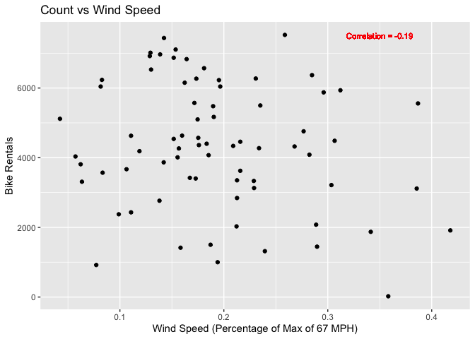
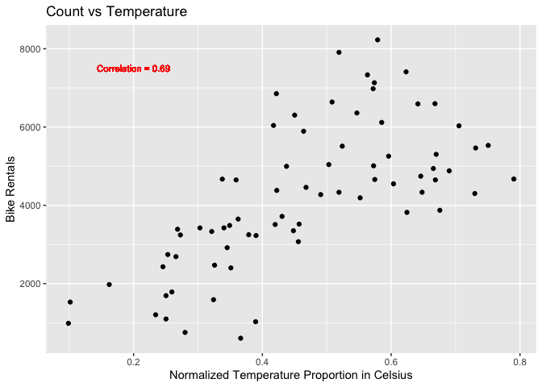
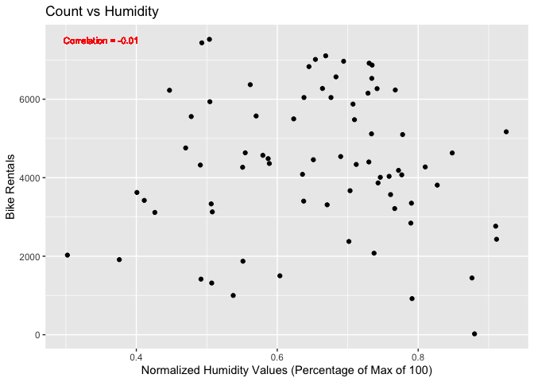

Project 2
================
Kolton Wiebusch
10/14/2020

  - [Required Packages](#required-packages)
  - [Introduction](#introduction)
      - [Purpose:](#purpose)
      - [Methods:](#methods)
      - [Data:](#data)
      - [Variables:](#variables)
  - [Data Split](#data-split)
  - [Summarizations](#summarizations)
  - [Plots](#plots)
  - [Modeling](#modeling)

# Required Packages

``` r
library(tidyverse)
library(caret)
library(knitr)
library(rpart)
```

# Introduction

## Purpose:

Use bike sharing data to analyze and create models predicting the cnt
response variable.

## Methods:

Load data in and select important variables only. Filter results for
each day of the week and create training and test sets from that data.
Produce some summary statistics and plots about the training data to
explore it. Fit a regression tree based model and a boosted tree model
on the data, then apply the fits on the test sets.

``` r
#Read in the data
bike <- read_csv("day.csv")

#Getting an idea for what predictors have the best
summary(lm(cnt ~ . - casual - registered, data = bike))
```

    ## 
    ## Call:
    ## lm(formula = cnt ~ . - casual - registered, data = bike)
    ## 
    ## Residuals:
    ##     Min      1Q  Median      3Q     Max 
    ## -4035.5  -446.9    46.5   548.2  2956.1 
    ## 
    ## Coefficients: (1 not defined because of singularities)
    ##              Estimate Std. Error t value Pr(>|t|)    
    ## (Intercept)  1326.457    248.267   5.343 1.23e-07 ***
    ## instant        -8.048      3.674  -2.190 0.028811 *  
    ## dteday             NA         NA      NA       NA    
    ## season        508.276     54.617   9.306  < 2e-16 ***
    ## yr           4986.655   1346.467   3.704 0.000229 ***
    ## mnth          206.655    113.424   1.822 0.068877 .  
    ## holiday      -522.868    200.519  -2.608 0.009308 ** 
    ## weekday        69.187     16.256   4.256 2.36e-05 ***
    ## workingday    122.130     71.822   1.700 0.089480 .  
    ## weathersit   -623.752     78.374  -7.959 6.79e-15 ***
    ## temp         2178.956   1401.652   1.555 0.120491    
    ## atemp        3391.410   1587.380   2.136 0.032978 *  
    ## hum          -960.439    314.303  -3.056 0.002328 ** 
    ## windspeed   -2520.931    455.384  -5.536 4.35e-08 ***
    ## ---
    ## Signif. codes:  0 '***' 0.001 '**' 0.01 '*' 0.05 '.' 0.1 ' ' 1
    ## 
    ## Residual standard error: 870.1 on 718 degrees of freedom
    ## Multiple R-squared:  0.8016, Adjusted R-squared:  0.7983 
    ## F-statistic: 241.7 on 12 and 718 DF,  p-value: < 2.2e-16

``` r
#Recreating the bike dataset with variables of interest
bike %>% select(season, holiday, weekday, workingday, weathersit, atemp, hum, windspeed, cnt) -> bike
```

## Data:

This data contains the daily count of rental bikes between 2011 and 2012
in Capital bike share system with the corresponding weather and seasonal
information.

## Variables:

After looking to see what variables had high p-values in a linear model
when predicting the response of cnt, as well as removing casual and
registered due to the instructions, I narrowed it down to 9. Cnt
represents the count of rental bikes daily. Season can be broken down
into 1 = winter, 2 = spring, 3 = summer, 4 = fall. Holiday returns 1 if
the day is a holiday. Weekday has a numeric value representing each day
of the week, from 0 = Sunday to 6 = Saturday. Workingday returns 1 if
the day is neither a weekend nor holiday. Weathersit has 4 levels
increasing in intensity: 1 - clear or few clouds, 2 - Mist or cloudy, 3
-light snow or light rain with some thunderstorms and scattered clouds,
4 - Heavy Rain/Sleet/Snow/Thunderstorms (More severe). Atemp is a
derived value of normalized feeling temperature. Hum is normalized
humidity values divided to 100 (max). Windspeed is normalized wind speed
values divided to 67 (max).

# Data Split

``` r
#Filtering the data by weekday
bike %>% filter(weekday == 0) -> newbike

#Splitting the data 70/30
set.seed(23)

train <- sample(1:nrow(newbike), size = nrow(newbike)*0.7)
test <- dplyr::setdiff(1:nrow(newbike), train)

bikeTrain <- newbike[train, ]
bikeTest <- newbike[test, ]
```

# Summarizations

These summary statistics give several looks at the response variable
cnt, or the count of rented bikes on this specific weekday for the
training data. The first one shows basic summary statistics for the
count. The second breaks the average and standard deviation of daily
count down by each season (1 = winter, 2 = spring, 3 = summer, 4 =
fall). The third breaks the average of daily count down by weather
situation on this weekday (1 = clear, 2 = cloudy, 3 = light
precipitation, 4 = heavy or severe precipitation).

``` r
#Summary stats of the response variable cnt
summary(bikeTrain$cnt)
```

    ##    Min. 1st Qu.  Median    Mean 3rd Qu.    Max. 
    ##     605    3228    4333    4225    5464    8227

``` r
#Summary stats of mean and standard deviation of count of rented bikes by season on this weekday
bikeTrain %>% group_by(season) %>% summarise(avg = mean(cnt), sd = sd(cnt))
```

    ## # A tibble: 4 x 3
    ##   season   avg    sd
    ##    <dbl> <dbl> <dbl>
    ## 1      1 2262. 1341.
    ## 2      2 4860. 1832.
    ## 3      3 5339. 1254.
    ## 4      4 4320. 1447.

``` r
#Summary stats of mean of count of rented bikes by weather situation on this weekday
bikeTrain %>% group_by(weathersit) %>% summarise(avg = mean(cnt))
```

    ## # A tibble: 3 x 2
    ##   weathersit   avg
    ##        <dbl> <dbl>
    ## 1          1 4323.
    ## 2          2 4153.
    ## 3          3 1027

# Plots

These scatter plots give a visual of how the response variable cnt, or
count of the rented bikes on this specific weekday for the training
data, correlates with several other continuous predictors. Overall, we
can see that temperature has the strongest correlation with the count;
as temperature increases, the number of bikes rented increases. The
correlations with humidity and wind speed are not quite as strong, but
it does appear that as wind speed increases, generally, the number of
bikes rented decreases somewhat.

``` r
wind <- ggplot(bikeTrain, aes(x = windspeed, y = cnt))
wind + geom_point() + labs(title = "Count vs Wind Speed", x = "Wind Speed (Percentage of Max of 67 MPH)", y = "Bike Rentals") + geom_text(x = .35, y = 7500, size = 3, label = paste0("Correlation = ", round(cor(bikeTrain$windspeed, bikeTrain$cnt), 2)), col = "red")
```

<!-- -->

``` r
temp <- ggplot(bikeTrain, aes(x = atemp, y = cnt))
temp + geom_point() + labs(title = "Count vs Temperature", x = "Normalized Temperature Proportion in Celsius", y = "Bike Rentals") + geom_text(x = .2, y = 7500, size = 3, label = paste0("Correlation = ", round(cor(bikeTrain$atemp, bikeTrain$cnt), 2)), col = "red")
```

<!-- -->

``` r
humidity <- ggplot(bikeTrain, aes(x = hum, y = cnt))
humidity + geom_point() + labs(title = "Count vs Humidity", x = "Normalized Humidity Values (Percentage of Max of 100)", y = "Bike Rentals") + geom_text(x = .35, y = 7500, size = 3, label = paste0("Correlation = ", round(cor(bikeTrain$hum, bikeTrain$cnt), 2)), col = "red")
```

<!-- -->

# Modeling
